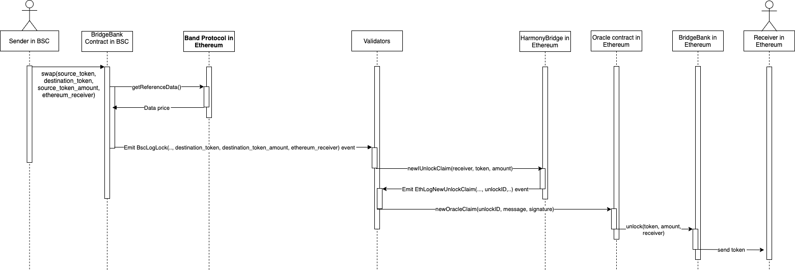

# ⛓ Atomic Swap

## Introduction

This application is used to swap atoms between our two native tokens, from Ethereum to the Binance Smart Chain and back.


An Atomic Swap is a smart contract technology which makes possible to exchange coins from two different blockchains without having to trust any third party.


Between two bridges of Ethereum - BSC, there are 2 relayers to be able to mint corresponding tokens when swapping between those two blockchains.

There will be validators at each bridge to verify the atomic swaps, when **75%** consensus is reached, the transaction will be executed by the relayer.

### Backend Architecture

#### Sequence Diagram

* Ethereum -> Binance smart chain

* Binance smart chain -> Ethereum

### Smart contracts:



Contract address: [https://etherscan.io/address/0x257709f1e7d4859b534eb57521f90d5213264466](https://etherscan.io/address/0x257709f1e7d4859b534eb57521f90d5213264466)

* Share.sol
* BridgeRegistry.sol
* EthereumBridge.sol



Contract Address: [https://bscscan.com/token/0xacda515a498e189b8fce6a882ef9f3cd706a55a3](https://bscscan.com/token/0xacda515a498e189b8fce6a882ef9f3cd706a55a3)

* Share.sol
* BridgeRegistry.sol
* EthereumBridge.sol



###
